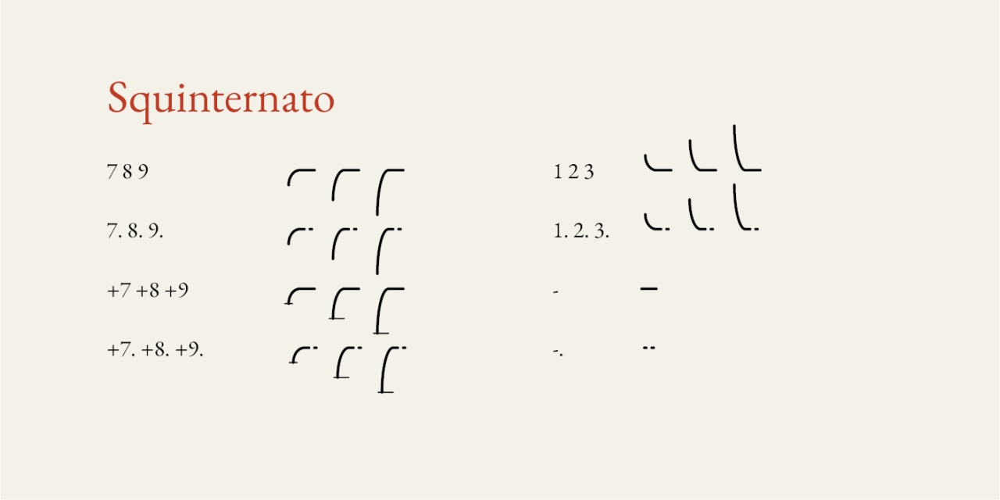
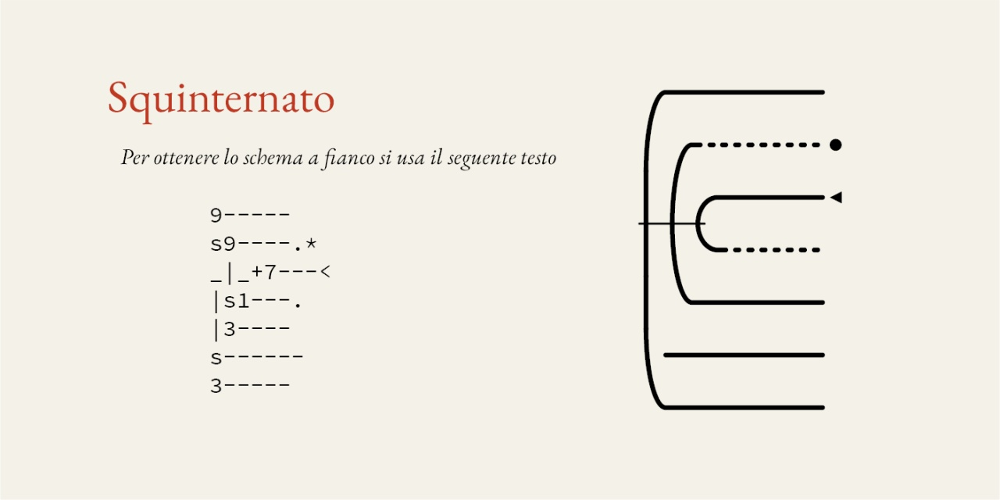

# Squinternato
- Versione 1.002: aggiunta /asterisk /less /greater per ottenere punto e frecce
- Versione 1.001: aggiunta /s per ottenere uno spazio
- Versione 1.000: versione iniziale

## Descrizione

Il carattere **Squinternato** è un esperimento per visualizzare la struttura di un manoscritto.

**Squinternato** ha metriche perfettamente compatibili con [Garamontio](https://github.com/m-casanova/Garamontio).
Sono presenti vari pesi (Regular, News, Medium, Semibold, Bold, ExtraBold) che modificano lo spessore delle righe.

I numeri sono utilizzati per mostrare le curve principali.
Sono utilizzati alcuni simboli:
- _/hyphen_ (-) per mostrare tratti orizzontali
- _/period_ (.) alla fine di una riga per rendere tratteggiata la riga (fogli mancanti)

Più segni sono utilizzati in combinazione con barre verticali, cioè _/asciicircum_ (^), _/underscore_ (_), /comma (,) 

Le diverse combinazioni permettono di creare anche strutture complesse.
Per ottenere uno spazio può essere utilizzata la lettera _/s_.

